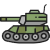

# RoboCode models
**Customized robots documentation** 

---

## Lunaris
*The Moon Light*

This model can take care of some space, and search for enemies on an 360-degree radius

## Cosmo
*The Omniscient*

This model walk in a zigzag line while shoot enemies across the way

## Neptune :star:
*The king*

This is the most complete model, can walk in a zigzag line, shoot enemies in a 360-degres radius and avoid all colision events

## Juno :heart:
*The chosen one*

This model can do anything, well..., this model will be able to do anithing when I finish the colisions issues, but his aim is ridiculously complex